# 📦 LogixPortal ERP - Prompt Maestro Profesional
## Sistema de Gestión de Cadena Global de Suministro End-to-End

**Versión:** 1.0  
**Fecha:** Marzo 2026  
**Autor:** Equipo de Arquitectura LogixPortal  

---

## 📑 TABLA DE CONTENIDOS

1. [Resumen Ejecutivo](#1-resumen-ejecutivo)
2. [Stack Tecnológico y Reglas de Oro](#2-stack-tecnológico-y-reglas-de-oro)
3. [Arquitectura del Sistema](#3-arquitectura-del-sistema)
4. [Modelo de Datos Incremental](#4-modelo-de-datos-incremental)
5. [Sistema Multi-Empresa](#5-sistema-multi-empresa)
6. [Normativa y Cumplimiento Legal Peruano](#6-normativa-y-cumplimiento-legal-peruano)
7. [Roadmap de Implementación por Fases](#7-roadmap-de-implementación-por-fases)
8. [Sistema de Suscripción por Módulos](#8-sistema-de-suscripción-por-módulos)
9. [Guías de Entrevistas a Usuarios](#9-guías-de-entrevistas-a-usuarios)
10. [Estimación de Tiempos y Recursos](#10-estimación-de-tiempos-y-recursos)
11. [Documentos Entregables por Fase](#11-documentos-entregables-por-fase)
12. [Diagramas Mermaid de Arquitectura](#12-diagramas-mermaid-de-arquitectura)

---

## 1. RESUMEN EJECUTIVO

### 1.1 Visión del Producto

**LogixPortal** es un sistema ERP especializado en la gestión end-to-end de la cadena global de suministro, diseñado específicamente para empresas peruanas que operan en comercio exterior. El sistema integra de forma nativa con todos los entes reguladores peruanos (SUNAT, SUNAD, SUNARP, RENIEC, VUCE) y cumple con estándares internacionales de auditoría y trazabilidad (BASC, OEA).

### 1.2 Diferenciadores Clave

- ✅ **Integración Nativa SUNAT**: Facturación electrónica, libros electrónicos, PLE
- ✅ **Gestión Aduanera Completa**: DUA/DSI, agentes de aduana, trazabilidad de contenedores
- ✅ **Geolocalización Avanzada**: PostGIS para rutas, almacenes, seguimiento GPS
- ✅ **Multi-Empresa, No Multi-Tenant**: Esquema compartido, aislamiento por company_id
- ✅ **Suscripción Flexible**: Activar/desactivar módulos por empresa
- ✅ **Arquitectura Moderna**: Serverpod 3 + Flutter Web + Riverpod 3 + Clean Architecture

### 1.3 Usuarios Target

| Tipo de Usuario | Descripción | Necesidades Clave |
|-----------------|-------------|-------------------|
| **Importador/Exportador** | Empresas de comercio exterior | DUA/DSI, costos de importación, trazabilidad |
| **Operador Logístico (3PL/4PL)** | Proveedores de servicios logísticos | Gestión multi-cliente, tracking, facturación |
| **Agente de Aduana** | Despachadores aduaneros | Gestión de documentos, coordinación SUNAD |
| **Almacén/Centro de Distribución** | Operadores de almacenaje | Control de inventarios, ubicaciones, WMS |
| **Transportista** | Empresas de transporte | Rutas, GPS, guías de remisión electrónicas |

---

## 2. STACK TECNOLÓGICO Y REGLAS DE ORO

### 2.1 Stack Definido

```yaml
# Backend
Framework: Serverpod 3.x (última versión estable)
Lenguaje: Dart 3.x
Base de Datos: PostgreSQL 15+
Extensiones PostgreSQL:
  - PostGIS: Geolocalización y cálculo de rutas
  - pgcrypto: Encriptación de datos sensibles
  - pg_trgm: Búsquedas difusas (fuzzy search)
  - uuid-ossp: Generación de UUIDs
Protocolo: JSON-RPC (via Serverpod)
Configuración: serverpod.yaml
Cache: Redis (opcional, para sesiones)
Jobs Asíncronos: Serverpod built-in scheduler

# Frontend
Framework: Flutter Web 3.x
Arquitectura: Clean Architecture Feature-First
Estado: Riverpod 3.x
Navegación: go_router (última versión compatible)
UI: Material Design 3 personalizado
Internacionalización: flutter_localizations + intl

# Librerías Flutter Clave
freezed: Modelos inmutables
json_serializable: Serialización JSON
dio: Cliente HTTP
flutter_map: Mapas con PostGIS
pdf: Generación de PDFs
qr_flutter: Códigos QR
excel: Exportación a Excel
```

### 2.2 Reglas de Oro (NO NEGOCIABLES)

#### ⚠️ REGLA #1: NO Interacción Directa con PostgreSQL

```dart
// ❌ INCORRECTO - NO hacer queries SQL directos
final result = await session.db.query('SELECT * FROM products WHERE...');

// ✅ CORRECTO - Usar serverpod.yaml y endpoints
final products = await Product.db.find(
  session,
  where: (t) => t.companyId.equals(companyId),
);
```

**Justificación**: Serverpod gestiona automáticamente:
- Migraciones de esquema
- Validación de tipos
- Optimización de queries
- Caché de consultas
- Seguridad contra SQL injection

#### ⚠️ REGLA #2: JSON-RPC cuando aplique

```dart
// Usar JSON-RPC para llamadas complejas o batch operations
final client = ServerpodClient('http://localhost:8080/');
final result = await client.rpcCall(
  'importOperation.processBatch',
  {'batchId': batchId},
);
```

**Cuando usar JSON-RPC vs REST:**
- JSON-RPC: Operaciones complejas, batch, transaccionales
- REST: CRUD simple, recursos individuales

#### ⚠️ REGLA #3: Inglés en Código, Español en UI

```dart
// ✅ CORRECTO
class PurchaseOrder {  // Inglés en código
  final String poNumber;
  final double totalAmount;
}

// En UI con i18n
Text(S.of(context).purchaseOrderTitle)  // "Orden de Compra" en español
```

#### ⚠️ REGLA #4: Feature-First, NO Layer-First

```
✅ CORRECTO (Feature-First)
lib/features/
  import_export/
    data/
    domain/
    presentation/

❌ INCORRECTO (Layer-First)
lib/
  data/
    import_export/
  domain/
    import_export/
  presentation/
    import_export/
```

#### ⚠️ REGLA #5: Inmutabilidad con Freezed

```dart
@freezed
class Product with _$Product {
  const factory Product({
    required String id,
    required String productCode,
    required String name,
    double? averageCost,
  }) = _Product;

  factory Product.fromJson(Map<String, dynamic> json) =>
      _$ProductFromJson(json);
}
```

---

## 3. ARQUITECTURA DEL SISTEMA

### 3.1 Diagrama de Arquitectura General

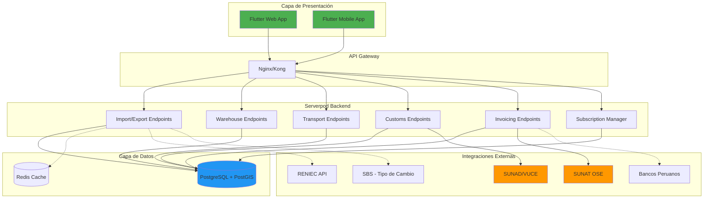

### 3.2 Clean Architecture Feature-First

```
lib/
├── main.dart
├── core/
│   ├── config/
│   │   ├── app_config.dart           # Configuración global
│   │   ├── environment.dart          # Variables de entorno
│   │   └── serverpod_client.dart     # Cliente Serverpod singleton
│   ├── routing/
│   │   ├── app_router.dart           # go_router config
│   │   └── route_guards.dart         # Guards de autenticación
│   ├── theme/
│   │   ├── app_theme.dart
│   │   ├── color_schemes.dart
│   │   └── text_styles.dart
│   ├── l10n/
│   │   ├── app_es.arb                # Español (default)
│   │   ├── app_en.arb                # Inglés
│   │   └── l10n.dart
│   ├── network/
│   │   ├── rpc_client.dart           # JSON-RPC wrapper
│   │   └── interceptors.dart
│   ├── errors/
│   │   ├── failures.dart
│   │   └── exceptions.dart
│   └── utils/
│       ├── validators.dart
│       ├── formatters.dart
│       ├── date_utils.dart
│       └── currency_utils.dart
│
├── features/
│   ├── auth/                         # Autenticación
│   │   ├── data/
│   │   │   ├── datasources/
│   │   │   │   └── auth_remote_datasource.dart
│   │   │   ├── models/
│   │   │   │   ├── user_model.dart
│   │   │   │   └── auth_response_model.dart
│   │   │   └── repositories/
│   │   │       └── auth_repository_impl.dart
│   │   ├── domain/
│   │   │   ├── entities/
│   │   │   │   └── user.dart
│   │   │   ├── repositories/
│   │   │   │   └── auth_repository.dart
│   │   │   └── usecases/
│   │   │       ├── login_usecase.dart
│   │   │       ├── logout_usecase.dart
│   │   │       └── validate_session_usecase.dart
│   │   └── presentation/
│   │       ├── providers/
│   │       │   ├── auth_provider.dart
│   │       │   └── user_provider.dart
│   │       ├── screens/
│   │       │   ├── login_screen.dart
│   │       │   └── profile_screen.dart
│   │       └── widgets/
│   │           └── login_form.dart
│   │
│   ├── import_export/                # Feature principal
│   │   ├── data/
│   │   ├── domain/
│   │   └── presentation/
│   │
│   ├── warehouse/                    # Gestión de almacenes
│   │   ├── data/
│   │   ├── domain/
│   │   └── presentation/
│   │
│   ├── transport/                    # Gestión de transporte
│   │   ├── data/
│   │   ├── domain/
│   │   └── presentation/
│   │
│   ├── customs/                      # Despachos aduaneros
│   │   ├── data/
│   │   ├── domain/
│   │   └── presentation/
│   │
│   ├── invoicing/                    # Facturación electrónica
│   │   ├── data/
│   │   ├── domain/
│   │   └── presentation/
│   │
│   └── subscription/                 # Gestión de suscripciones
│       ├── data/
│       ├── domain/
│       └── presentation/
│
└── shared/
    ├── models/
    │   ├── pagination.dart
    │   └── api_response.dart
    ├── widgets/
    │   ├── common_app_bar.dart
    │   ├── loading_indicator.dart
    │   ├── error_widget.dart
    │   └── data_table.dart
    └── providers/
        ├── company_provider.dart     # Empresa actual del usuario
        └── module_access_provider.dart  # Módulos activos
```

### 3.3 Flujo de Comunicación Cliente-Servidor

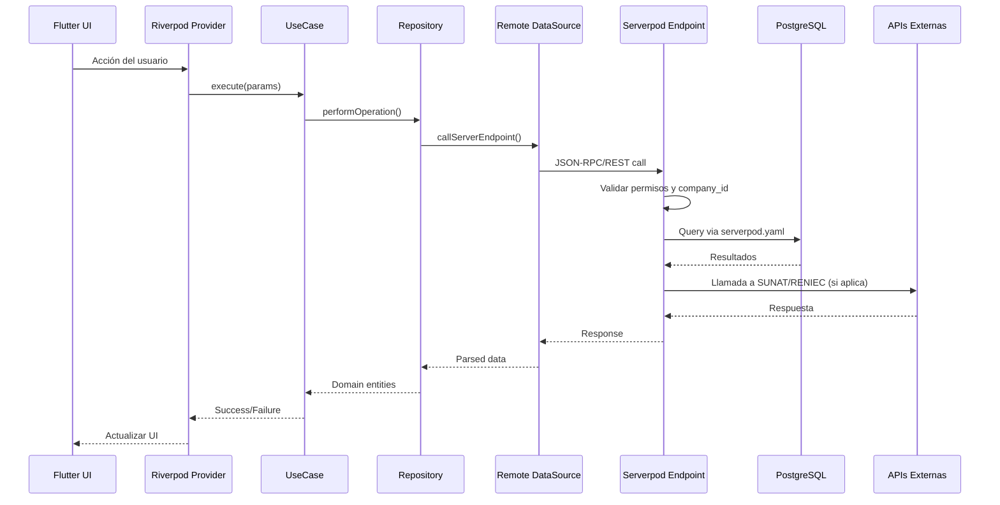

---

## 4. MODELO DE DATOS INCREMENTAL

### 4.1 Filosofía del Diseño Incremental

El modelo de datos se organiza en **3 niveles de estabilidad**:

#### Nivel 1: CORE (Nunca cambian)
- Companies
- Users
- Roles
- Products
- BusinessPartners
- Warehouses

#### Nivel 2: BUSINESS (Evolucionan moderadamente)
- PurchaseOrders
- SalesOrders
- InventoryMovements
- ElectronicDocuments

#### Nivel 3: EXTENSION (Flexibles y customizables)
- CustomsDeclarations
- ShipmentTracking
- QualityInspections
- Metadata JSON fields

### 4.2 Esquema PostgreSQL Multi-Empresa

```yaml
Estrategia: Multi-empresa en esquema único (public)
Aislamiento: company_id en TODAS las tablas transaccionales
Ventajas:
  - Migraciones simplificadas
  - Queries más eficientes (sin schemas dinámicos)
  - Backup/restore unificado
  - Costos de infraestructura optimizados

Desventajas mitigadas:
  - Row-Level Security (RLS) para seguridad adicional
  - Índices compuestos (company_id, ...)
  - Middleware de validación de company_id
```

### 4.3 Definición de Entidades Core (serverpod.yaml)

```yaml
# ================================================================
# CORE ENTITIES - Level 1 (Alta estabilidad)
# ================================================================

class: Company
table: companies
fields:
  id:
    type: UuidValue
    database: uuid DEFAULT uuid_generate_v4() PRIMARY KEY
  companyCode:
    type: String
    database: VARCHAR(20) UNIQUE NOT NULL
  businessName:
    type: String
    database: VARCHAR(300) NOT NULL
  tradeName:
    type: String?
    database: VARCHAR(300)
  taxId:
    type: String
    database: VARCHAR(20) UNIQUE NOT NULL  # RUC en Perú
  taxIdType:
    type: String
    database: VARCHAR(10) NOT NULL  # RUC, DNI, CE
  address:
    type: String?
    database: TEXT
  ubigeoCode:
    type: String?
    database: VARCHAR(6)
    foreign: ubigeos(code)
  latitude:
    type: double?
    database: DOUBLE PRECISION
  longitude:
    type: double?
    database: DOUBLE PRECISION
  phone:
    type: String?
    database: VARCHAR(20)
  email:
    type: String?
    database: VARCHAR(100)
  website:
    type: String?
    database: VARCHAR(200)
  logoUrl:
    type: String?
    database: TEXT
  subscriptionTier:
    type: String
    database: VARCHAR(20) DEFAULT 'BASIC'  # BASIC, PROFESSIONAL, ENTERPRISE
  activeModules:
    type: List<String>
    database: JSONB DEFAULT '[]'::jsonb
  isActive:
    type: bool
    database: BOOLEAN DEFAULT true
  metadata:
    type: String?
    database: JSONB
  createdAt:
    type: DateTime
    database: TIMESTAMP DEFAULT NOW()
  updatedAt:
    type: DateTime
    database: TIMESTAMP DEFAULT NOW()
indexes:
  - name: idx_companies_tax_id
    fields: [taxId]
    unique: true
  - name: idx_companies_active
    fields: [isActive]
  - name: idx_companies_location
    fields: [latitude, longitude]
    type: gist  # PostGIS index

---

class: User
table: users
fields:
  id:
    type: UuidValue
    database: uuid PRIMARY KEY DEFAULT uuid_generate_v4()
  companyId:
    type: UuidValue
    database: uuid NOT NULL REFERENCES companies(id) ON DELETE CASCADE
  email:
    type: String
    database: VARCHAR(100) UNIQUE NOT NULL
  passwordHash:
    type: String
    database: VARCHAR(255) NOT NULL
  firstName:
    type: String
    database: VARCHAR(100) NOT NULL
  lastName:
    type: String
    database: VARCHAR(100) NOT NULL
  documentType:
    type: String
    database: VARCHAR(10)  # DNI, CE, PASAPORTE
  documentNumber:
    type: String?
    database: VARCHAR(20)
  phone:
    type: String?
    database: VARCHAR(20)
  avatarUrl:
    type: String?
    database: TEXT
  roleId:
    type: UuidValue?
    database: uuid REFERENCES roles(id)
  twoFactorEnabled:
    type: bool
    database: BOOLEAN DEFAULT false
  twoFactorSecret:
    type: String?
    database: VARCHAR(100)
  isActive:
    type: bool
    database: BOOLEAN DEFAULT true
  lastLoginAt:
    type: DateTime?
    database: TIMESTAMP
  passwordChangedAt:
    type: DateTime
    database: TIMESTAMP DEFAULT NOW()
  metadata:
    type: String?
    database: JSONB
  createdAt:
    type: DateTime
    database: TIMESTAMP DEFAULT NOW()
  updatedAt:
    type: DateTime
    database: TIMESTAMP DEFAULT NOW()
indexes:
  - name: idx_users_company
    fields: [companyId, isActive]
  - name: idx_users_email
    fields: [email]
    unique: true

---

class: Role
table: roles
fields:
  id:
    type: UuidValue
    database: uuid PRIMARY KEY DEFAULT uuid_generate_v4()
  companyId:
    type: UuidValue
    database: uuid NOT NULL REFERENCES companies(id) ON DELETE CASCADE
  name:
    type: String
    database: VARCHAR(100) NOT NULL
  description:
    type: String?
    database: TEXT
  permissions:
    type: List<String>
    database: JSONB NOT NULL DEFAULT '[]'::jsonb
  isSystemRole:
    type: bool
    database: BOOLEAN DEFAULT false
  metadata:
    type: String?
    database: JSONB
  createdAt:
    type: DateTime
    database: TIMESTAMP DEFAULT NOW()
indexes:
  - name: idx_roles_company
    fields: [companyId]
  - name: idx_roles_company_name
    fields: [companyId, name]
    unique: true

---

class: Product
table: products
fields:
  id:
    type: UuidValue
    database: uuid PRIMARY KEY DEFAULT uuid_generate_v4()
  companyId:
    type: UuidValue
    database: uuid NOT NULL REFERENCES companies(id) ON DELETE CASCADE
  productCode:
    type: String
    database: VARCHAR(50) NOT NULL
  internalCode:
    type: String?
    database: VARCHAR(50)
  barcode:
    type: String?
    database: VARCHAR(50)
  name:
    type: String
    database: VARCHAR(300) NOT NULL
  description:
    type: String?
    database: TEXT
  categoryId:
    type: UuidValue?
    database: uuid REFERENCES product_categories(id)
  unitOfMeasureCode:
    type: String
    database: VARCHAR(10) NOT NULL  # NIU, KGM, MTR (códigos SUNAT)
  productType:
    type: String
    database: VARCHAR(20) DEFAULT 'FINISHED_GOOD'
  hsCode:
    type: String?
    database: VARCHAR(12)  # Partida arancelaria
  originCountryCode:
    type: String?
    database: VARCHAR(2)  # ISO 3166-1 alpha-2
  isSerialized:
    type: bool
    database: BOOLEAN DEFAULT false
  isBatchControlled:
    type: bool
    database: BOOLEAN DEFAULT false
  shelfLifeDays:
    type: int?
    database: INTEGER
  minimumStock:
    type: double
    database: NUMERIC(15,4) DEFAULT 0
  reorderPoint:
    type: double?
    database: NUMERIC(15,4)
  standardCost:
    type: double?
    database: NUMERIC(15,4)
  averageCost:
    type: double?
    database: NUMERIC(15,4)
  salePrice:
    type: double?
    database: NUMERIC(15,4)
  taxType:
    type: String
    database: VARCHAR(20) DEFAULT 'IGV'  # IGV, EXONERATED, EXEMPT
  igvRate:
    type: double
    database: NUMERIC(5,2) DEFAULT 18.00
  weightKg:
    type: double?
    database: NUMERIC(10,4)
  volumeM3:
    type: double?
    database: NUMERIC(10,6)
  isActive:
    type: bool
    database: BOOLEAN DEFAULT true
  metadata:
    type: String?
    database: JSONB
  createdAt:
    type: DateTime
    database: TIMESTAMP DEFAULT NOW()
  updatedAt:
    type: DateTime
    database: TIMESTAMP DEFAULT NOW()
indexes:
  - name: idx_products_company_code
    fields: [companyId, productCode]
    unique: true
  - name: idx_products_barcode
    fields: [barcode]
  - name: idx_products_hs_code
    fields: [hsCode]
  - name: idx_products_search
    fields: [name, description]
    type: gin  # Full-text search index
```

*Continúa con más entidades...*

### 4.4 Diagrama ER Simplificado

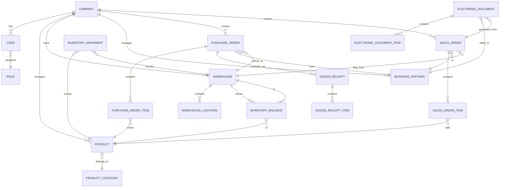

---

## 5. SISTEMA MULTI-EMPRESA (NO MULTI-TENANT)

### 5.1 Arquitectura de Aislamiento

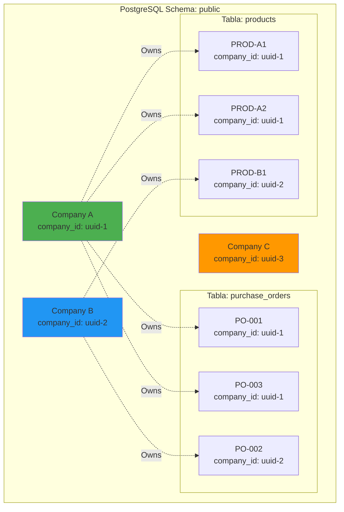

### 5.2 Implementación de Row-Level Security (RLS)

```sql
-- Habilitar RLS en todas las tablas transaccionales
ALTER TABLE purchase_orders ENABLE ROW LEVEL SECURITY;
ALTER TABLE sales_orders ENABLE ROW LEVEL SECURITY;
ALTER TABLE products ENABLE ROW LEVEL SECURITY;
ALTER TABLE inventory_balances ENABLE ROW LEVEL SECURITY;

-- Política: Los usuarios solo ven datos de su empresa
CREATE POLICY company_isolation_policy ON purchase_orders
    USING (company_id = current_setting('app.current_company_id')::uuid);

CREATE POLICY company_isolation_policy ON sales_orders
    USING (company_id = current_setting('app.current_company_id')::uuid);

CREATE POLICY company_isolation_policy ON products
    USING (company_id = current_setting('app.current_company_id')::uuid);
```

### 5.3 Middleware de Validación en Serverpod

```dart
// lib/server/middleware/company_validation_middleware.dart

class CompanyValidationMiddleware extends Middleware {
  @override
  Future<void> preProcessRequest(Session session) async {
    // Obtener company_id del token JWT
    final companyId = session.auth.companyId;
    
    if (companyId == null) {
      throw UnauthorizedException('Company ID not found in session');
    }
    
    // Establecer company_id en sesión de PostgreSQL
    await session.db.execute(
      "SET LOCAL app.current_company_id = '$companyId'",
    );
    
    // Validar que la empresa esté activa
    final company = await Company.db.findById(session, companyId);
    if (company == null || !company.isActive) {
      throw ForbiddenException('Company is inactive');
    }
    
    // Guardar en contexto de sesión
    session.setData('companyId', companyId);
  }
}
```

---

## 6. NORMATIVA Y CUMPLIMIENTO LEGAL PERUANO

### 6.1 Integraciones con Entes Reguladores

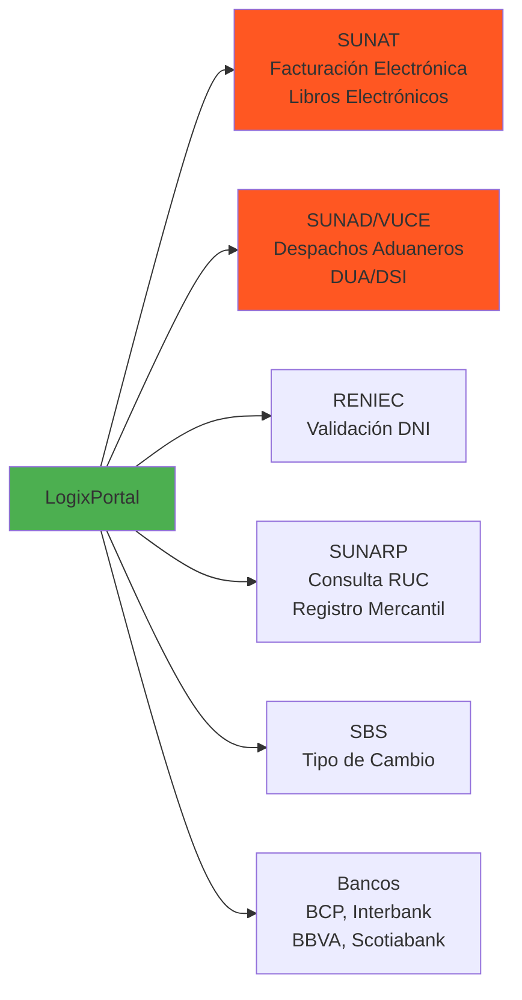

### 6.2 SUNAT - Facturación Electrónica

**Requisitos:**
- Certificado digital (.pfx) vigente
- OSE homologado o envío directo a SUNAT
- Formato UBL 2.1 con firma digital
- Códigos de tipo de documento: 01 (Factura), 03 (Boleta), 07 (NC), 08 (ND)

**Flujo de Emisión:**

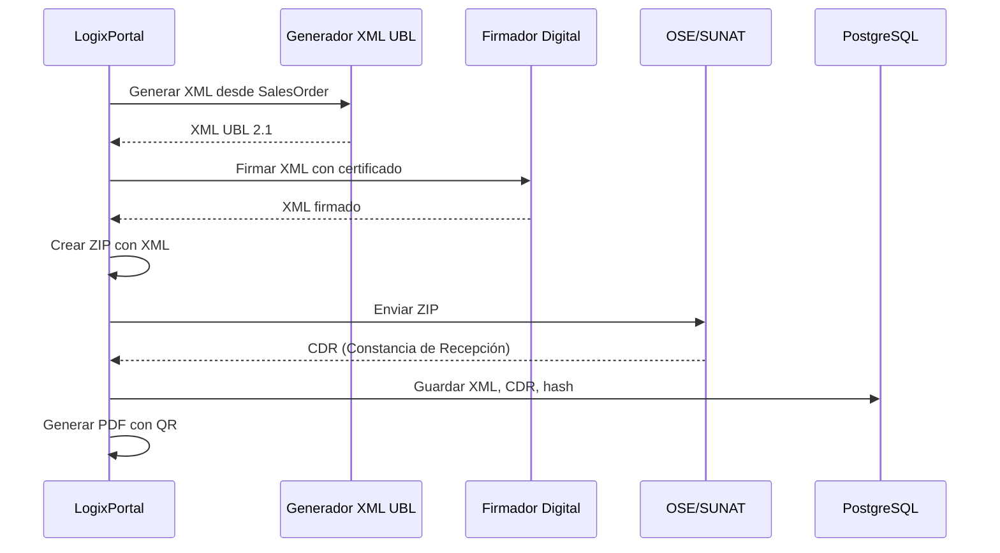

**Implementación en Serverpod:**

```dart
// lib/server/services/sunat_invoice_service.dart

class SunatInvoiceService {
  final XmlSignerService _xmlSigner;
  final SunatOseClient _oseClient;
  
  Future<InvoiceResult> issueElectronicInvoice(
    Session session,
    SalesOrder salesOrder,
  ) async {
    // 1. Generar XML UBL 2.1
    final xml = await _generateUblXml(salesOrder);
    
    // 2. Firmar digitalmente
    final signedXml = await _xmlSigner.signXml(
      xml,
      certificatePath: await _getCertificatePath(session.auth.companyId),
      certificatePassword: await _getCertificatePassword(session.auth.companyId),
    );
    
    // 3. Crear ZIP
    final zipBytes = await _createZipFile(
      fileName: '${salesOrder.companyId}-${salesOrder.documentType}-${salesOrder.serie}-${salesOrder.number}',
      xmlContent: signedXml,
    );
    
    // 4. Enviar a OSE/SUNAT
    final response = await _oseClient.sendDocument(
      rucEmisor: salesOrder.company.taxId,
      tipoDocumento: salesOrder.documentType,
      serie: salesOrder.serie,
      numero: salesOrder.number,
      zipContent: zipBytes,
    );
    
    // 5. Procesar CDR
    if (response.isSuccess) {
      final cdr = await _parseCDR(response.cdrBytes);
      
      // Guardar en BD
      await ElectronicDocument.db.updateRow(
        session,
        ElectronicDocument(
          id: salesOrder.id,
          status: 'ACCEPTED',
          xmlContent: signedXml,
          cdrContent: String.fromCharCodes(response.cdrBytes),
          cdrResponseCode: cdr.responseCode,
          hashCode: cdr.hashCode,
          sentToSunatAt: DateTime.now(),
          acceptedBySunatAt: DateTime.now(),
        ),
      );
      
      return InvoiceResult.success(cdr: cdr);
    } else {
      throw SunatException(response.errorMessage);
    }
  }
}
```

### 6.3 SUNAT - Libros Electrónicos (PLE)

**Formatos Requeridos:**
- Registro de Compras: 8.1
- Registro de Ventas: 14.1
- Libro Diario: 5.1
- Libro Mayor: 6.1

**Nombrado de Archivos:**
```
LE[RUC][AÑO][MES][DÍA][LIBRO][OPR][CONT][MONEDA][FLAG].txt

Ejemplo:
LE20123456789202403001401000111.txt
  └─RUC: 20123456789
    └─Periodo: 202403 (Marzo 2024)
      └─Libro: 1401 (Registro de Ventas)
        └─Moneda: 1 (Soles)
```

### 6.4 SUNAD/VUCE - Despachos Aduaneros

**Documentos de Despacho:**
- DUA (Declaración Única de Aduanas) - Importación
- DSI (Declaración Simplificada de Importación)
- Declaración de Exportación

**Datos Requeridos:**
- Código de Aduana
- Régimen Aduanero (10: Importación definitiva, 40: Exportación definitiva)
- Partida Arancelaria (HS Code)
- Valor FOB/CIF
- Peso bruto/neto
- País de origen/destino

### 6.5 Auditoría y Trazabilidad (BASC, OEA)

**BASC (Business Alliance for Secure Commerce):**
- Trazabilidad completa de contenedores
- Registro de inspecciones de seguridad
- Control de acceso a almacenes
- Bitácora de eventos de seguridad

**OEA (Operador Económico Autorizado):**
- Histórico de transacciones por 5 años
- Auditoría de cambios en documentos
- Segregación de funciones
- Control de versiones de documentos

**Implementación:**

```dart
// Tabla de auditoría
class AuditLog {
  final UuidValue id;
  final UuidValue companyId;
  final UuidValue userId;
  final String action;  // CREATE, UPDATE, DELETE, APPROVE, REJECT
  final String entityType;  // purchase_order, sales_order, etc.
  final UuidValue entityId;
  final Map<String, dynamic>? oldValues;
  final Map<String, dynamic>? newValues;
  final String ipAddress;
  final String userAgent;
  final DateTime timestamp;
}

// Middleware de auditoría
class AuditMiddleware extends Middleware {
  @override
  Future<void> postProcessRequest(Session session) async {
    if (session.endpoint.requiresAudit) {
      await AuditLog.db.insertRow(
        session,
        AuditLog(
          companyId: session.auth.companyId,
          userId: session.auth.userId,
          action: session.method,
          entityType: session.endpoint.entityType,
          entityId: session.endpoint.entityId,
          ipAddress: session.httpRequest.remoteAddress.address,
          userAgent: session.httpRequest.headers['user-agent'] ?? '',
          timestamp: DateTime.now(),
        ),
      );
    }
  }
}
```

---

## 7. ROADMAP DE IMPLEMENTACIÓN POR FASES

### 7.1 Estrategia de Entrega Incremental

**Principio:** Cada fase debe entregar un **MVP funcional** que aporte valor inmediato al negocio.

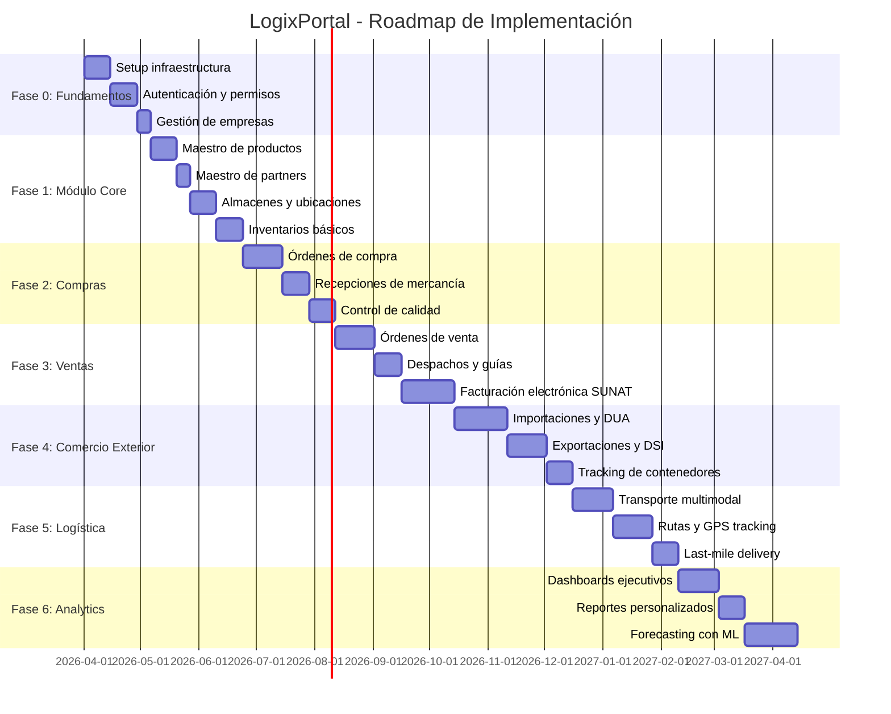

### 7.2 Fase 0: Fundamentos (5 semanas)

**Objetivo:** Infraestructura base y sistema de autenticación funcional.

**Entregables:**
1. ✅ Proyecto Serverpod 3 configurado con PostgreSQL + PostGIS
2. ✅ Sistema de autenticación JWT con 2FA
3. ✅ Gestión de roles y permisos (RBAC)
4. ✅ CRUD de empresas (multi-empresa)
5. ✅ Sistema de suscripciones y activación de módulos
6. ✅ Internacionalización (ES/EN)
7. ✅ Tema corporativo Material Design 3

**Historias de Usuario:**
- Como administrador, quiero crear usuarios y asignarles roles
- Como usuario, quiero iniciar sesión con 2FA
- Como administrador, quiero gestionar empresas y sus módulos activos

**Criterios de Aceptación:**
- Login funcional con email/password
- 2FA via TOTP (Google Authenticator)
- Creación de empresas con RUC válido (validación con SUNAT)
- Asignación de módulos según tier de suscripción

### 7.3 Fase 1: Módulo Core (7 semanas)

**Objetivo:** Maestros fundamentales y gestión básica de inventarios.

**Entregables:**
1. ✅ CRUD Productos con categorías, HS Code, código de barras
2. ✅ CRUD Partners (proveedores/clientes)
3. ✅ CRUD Almacenes con geolocalización (PostGIS)
4. ✅ CRUD Ubicaciones de almacén (rack/shelf/bin)
5. ✅ Gestión de inventarios (balances, movimientos)
6. ✅ Consulta de tipo de cambio SBS
7. ✅ Búsqueda avanzada con filtros

**Historias de Usuario:**
- Como comprador, quiero buscar productos por código, nombre o barcode
- Como almacenero, quiero ver el stock actual por ubicación
- Como gerente, quiero ver el valor total del inventario

**Criterios de Aceptación:**
- Importación masiva de productos desde Excel
- Validación de RUC en tiempo real (API SUNAT)
- Cálculo automático de stock disponible (quantity - reserved_quantity)
- Kardex de movimientos de inventario

### 7.4 Fase 2: Módulo de Compras (7 semanas)

**Objetivo:** Ciclo completo de compras nacionales e importaciones básicas.

**Entregables:**
1. ✅ Órdenes de compra (PO) con flujo de aprobación
2. ✅ Recepciones de mercancía con control de calidad
3. ✅ Costos de importación (CIF, FOB, freight, insurance)
4. ✅ Generación automática de movimientos de inventario
5. ✅ Dashboard de POs pendientes y recepciones
6. ✅ Reporte de órdenes por proveedor

**Historias de Usuario:**
- Como comprador, quiero crear POs y enviarlas por email
- Como almacenero, quiero registrar recepciones y generar reportes de discrepancias
- Como contador, quiero ver los costos de importación detallados

**Criterios de Aceptación:**
- Flujo de aprobación multi-nivel (requester → supervisor → manager)
- Cálculo automático de IGV y totales
- Conversión de moneda automática (USD → PEN)
- Generación de PDF de PO

### 7.5 Fase 3: Módulo de Ventas y Facturación (9 semanas)

**Objetivo:** Ciclo completo de ventas con facturación electrónica SUNAT.

**Entregables:**
1. ✅ Órdenes de venta (SO) con reserva de inventario
2. ✅ Guías de remisión electrónicas
3. ✅ Facturación electrónica SUNAT (Facturas, Boletas, NC, ND)
4. ✅ Integración con OSE
5. ✅ Generación de PDF con QR y código de barras
6. ✅ Envío por email al cliente
7. ✅ Dashboard de ventas

**Historias de Usuario:**
- Como vendedor, quiero crear cotizaciones y convertirlas en SO
- Como facturador, quiero emitir facturas electrónicas y enviarlas a SUNAT
- Como gerente, quiero ver el dashboard de ventas por período

**Criterios de Aceptación:**
- Factura electrónica emitida y aceptada por SUNAT
- CDR almacenado en sistema
- PDF generado con QR estándar SUNAT
- Libros electrónicos PLE generados automáticamente

### 7.6 Fase 4: Comercio Exterior (9 semanas)

**Objetivo:** Gestión completa de importaciones/exportaciones con despacho aduanero.

**Entregables:**
1. ✅ Registro de DUA (importación)
2. ✅ Registro de DSI (exportación)
3. ✅ Tracking de contenedores
4. ✅ Gestión de agentes de aduana
5. ✅ Cálculo de derechos e impuestos
6. ✅ Integración VUCE
7. ✅ Reporte de operaciones de comercio exterior

**Historias de Usuario:**
- Como importador, quiero registrar una DUA y ver los costos de importación
- Como exportador, quiero generar la DSI y enviarla a VUCE
- Como gerente, quiero ver el tracking de mis contenedores en tiempo real

**Criterios de Aceptación:**
- DUA/DSI generada con todos los campos requeridos
- Integración VUCE funcional
- Tracking de contenedores via APIs de navieras
- Alertas de llegada de contenedores

### 7.7 Fase 5: Logística y Transporte (8 semanas)

**Objetivo:** Gestión de rutas, tracking GPS y last-mile delivery.

**Entregables:**
1. ✅ Planificación de rutas con PostGIS
2. ✅ Integración GPS tracking
3. ✅ Gestión de flota (vehículos, choferes)
4. ✅ Guías de remisión electrónicas
5. ✅ Proof of Delivery (POD) digital
6. ✅ Optimización de rutas con algoritmos
7. ✅ Dashboard de operaciones logísticas

**Historias de Usuario:**
- Como despachador, quiero crear rutas optimizadas
- Como chofer, quiero ver mi ruta del día en el móvil
- Como cliente, quiero ver el tracking de mi pedido en tiempo real

**Criterios de Aceptación:**
- Rutas calculadas con PostGIS (distancia real por carreteras)
- Tracking GPS actualizado cada 5 minutos
- POD con firma digital y foto

### 7.8 Fase 6: Analytics y Forecasting (9 semanas)

**Objetivo:** Dashboards ejecutivos y pronósticos de demanda con ML.

**Entregables:**
1. ✅ Dashboard ejecutivo (KPIs generales)
2. ✅ Dashboard de inventarios (rotación, obsolescencia)
3. ✅ Dashboard de ventas (análisis de tendencias)
4. ✅ Reportes personalizados con filtros
5. ✅ Exportación a Excel/PDF
6. ✅ Forecasting de demanda con ML (Prophet, ARIMA)
7. ✅ Alertas automáticas (stock bajo, vencimientos)

**Historias de Usuario:**
- Como gerente, quiero ver KPIs en tiempo real
- Como planner, quiero ver el forecast de demanda para los próximos 3 meses
- Como contador, quiero exportar reportes financieros a Excel

**Criterios de Aceptación:**
- Dashboards con actualización en tiempo real
- Forecast con precisión >80%
- Exportación de reportes con formato profesional

---

## 8. SISTEMA DE SUSCRIPCIÓN POR MÓDULOS

### 8.1 Tiers de Suscripción

```yaml
BASIC:
  precio_mensual: $199 USD
  usuarios: 5
  empresas: 1
  almacenes: 2
  módulos_incluidos:
    - Maestros (productos, partners)
    - Inventarios básicos
    - Compras locales
    - Ventas básicas
  módulos_opcionales: []
  soporte: Email (48h)

PROFESSIONAL:
  precio_mensual: $499 USD
  usuarios: 20
  empresas: 3
  almacenes: 10
  módulos_incluidos:
    - Todos los de BASIC
    - Facturación electrónica SUNAT
    - Importaciones/Exportaciones
    - Transporte y rutas
  módulos_opcionales:
    - WMS avanzado (+$99/mes)
    - Forecasting ML (+$149/mes)
  soporte: Email/Chat (24h)

ENTERPRISE:
  precio_mensual: Personalizado
  usuarios: Ilimitados
  empresas: Ilimitadas
  almacenes: Ilimitados
  módulos_incluidos:
    - Todos los módulos
    - API access
    - White-label
    - Integraciones custom
  módulos_opcionales: []
  soporte: Email/Chat/Phone (4h) + Account Manager
```

### 8.2 Tabla de Módulos y Funcionalidades

| Módulo | Código | BASIC | PROFESSIONAL | ENTERPRISE |
|--------|--------|-------|--------------|------------|
| **Core** | `MODULE_CORE` | ✅ | ✅ | ✅ |
| Maestro de Productos | `FEATURE_PRODUCTS` | ✅ | ✅ | ✅ |
| Maestro de Partners | `FEATURE_PARTNERS` | ✅ | ✅ | ✅ |
| Almacenes Básicos | `FEATURE_WAREHOUSES_BASIC` | ✅ | ✅ | ✅ |
| **Inventarios** | `MODULE_INVENTORY` | ✅ | ✅ | ✅ |
| Movimientos de Inventario | `FEATURE_INVENTORY_MOVEMENTS` | ✅ | ✅ | ✅ |
| Trazabilidad Lote/Serie | `FEATURE_BATCH_SERIAL` | ❌ | ✅ | ✅ |
| WMS Avanzado | `FEATURE_WMS_ADVANCED` | ❌ | ➕ Add-on | ✅ |
| **Compras** | `MODULE_PROCUREMENT` | ✅ | ✅ | ✅ |
| Órdenes de Compra | `FEATURE_PURCHASE_ORDERS` | ✅ | ✅ | ✅ |
| Recepciones | `FEATURE_GOODS_RECEIPTS` | ✅ | ✅ | ✅ |
| Control de Calidad | `FEATURE_QUALITY_CONTROL` | ❌ | ✅ | ✅ |
| **Ventas** | `MODULE_SALES` | ✅ | ✅ | ✅ |
| Órdenes de Venta | `FEATURE_SALES_ORDERS` | ✅ | ✅ | ✅ |
| Cotizaciones | `FEATURE_QUOTATIONS` | ❌ | ✅ | ✅ |
| **Facturación** | `MODULE_INVOICING` | ❌ | ✅ | ✅ |
| Facturación Electrónica SUNAT | `FEATURE_SUNAT_INVOICING` | ❌ | ✅ | ✅ |
| Libros Electrónicos PLE | `FEATURE_PLE` | ❌ | ✅ | ✅ |
| **Comercio Exterior** | `MODULE_FOREIGN_TRADE` | ❌ | ✅ | ✅ |
| Importaciones (DUA) | `FEATURE_IMPORTS` | ❌ | ✅ | ✅ |
| Exportaciones (DSI) | `FEATURE_EXPORTS` | ❌ | ✅ | ✅ |
| Tracking Contenedores | `FEATURE_CONTAINER_TRACKING` | ❌ | ✅ | ✅ |
| **Logística** | `MODULE_LOGISTICS` | ❌ | ✅ | ✅ |
| Rutas y Transporte | `FEATURE_ROUTES` | ❌ | ✅ | ✅ |
| GPS Tracking | `FEATURE_GPS_TRACKING` | ❌ | ✅ | ✅ |
| Guías de Remisión | `FEATURE_DELIVERY_GUIDES` | ❌ | ✅ | ✅ |
| **Analytics** | `MODULE_ANALYTICS` | ❌ | ❌ | ✅ |
| Dashboards Básicos | `FEATURE_DASHBOARDS_BASIC` | ✅ | ✅ | ✅ |
| Reportes Avanzados | `FEATURE_REPORTS_ADVANCED` | ❌ | ✅ | ✅ |
| Forecasting ML | `FEATURE_FORECASTING_ML` | ❌ | ➕ Add-on | ✅ |

### 8.3 Implementación del Sistema de Suscripción

```dart
// lib/server/services/subscription_service.dart

class SubscriptionService {
  
  /// Verifica si una empresa tiene acceso a un módulo
  Future<bool> hasModuleAccess(
    Session session,
    String moduleCode,
  ) async {
    final company = await Company.db.findById(
      session,
      session.auth.companyId,
    );
    
    if (company == null || !company.isActive) {
      return false;
    }
    
    // Verificar en activeModules (JSONB array)
    return company.activeModules.contains(moduleCode);
  }
  
  /// Verifica si una empresa tiene acceso a una funcionalidad
  Future<bool> hasFeatureAccess(
    Session session,
    String featureCode,
  ) async {
    final company = await Company.db.findById(
      session,
      session.auth.companyId,
    );
    
    if (company == null || !company.isActive) {
      return false;
    }
    
    // Obtener tier de suscripción
    final tier = company.subscriptionTier; // BASIC, PROFESSIONAL, ENTERPRISE
    
    // Obtener configuración de features por tier
    final tierConfig = _getTierConfiguration(tier);
    
    // Verificar si el feature está incluido en el tier
    if (tierConfig.includedFeatures.contains(featureCode)) {
      return true;
    }
    
    // Verificar si el feature está en los add-ons activos
    return company.activeModules.contains(featureCode);
  }
  
  /// Activa un módulo add-on para una empresa
  Future<void> activateAddon(
    Session session,
    String addonCode,
  ) async {
    final company = await Company.db.findById(
      session,
      session.auth.companyId,
    );
    
    if (company == null) {
      throw NotFoundException('Company not found');
    }
    
    // Verificar que el addon no esté ya activo
    if (company.activeModules.contains(addonCode)) {
      throw ConflictException('Addon already active');
    }
    
    // Verificar que el addon sea válido para el tier actual
    final tierConfig = _getTierConfiguration(company.subscriptionTier);
    if (!tierConfig.availableAddons.contains(addonCode)) {
      throw ForbiddenException('Addon not available for current tier');
    }
    
    // Activar addon
    final updatedModules = [...company.activeModules, addonCode];
    await Company.db.updateRow(
      session,
      company.copyWith(activeModules: updatedModules),
    );
    
    // Registrar en auditoría
    await _auditLog(session, 'ACTIVATE_ADDON', addonCode);
  }
  
  /// Desactiva un módulo add-on
  Future<void> deactivateAddon(
    Session session,
    String addonCode,
  ) async {
    final company = await Company.db.findById(
      session,
      session.auth.companyId,
    );
    
    if (company == null) {
      throw NotFoundException('Company not found');
    }
    
    // Remover addon
    final updatedModules = company.activeModules
        .where((m) => m != addonCode)
        .toList();
        
    await Company.db.updateRow(
      session,
      company.copyWith(activeModules: updatedModules),
    );
    
    // Auditoría
    await _auditLog(session, 'DEACTIVATE_ADDON', addonCode);
  }
}

// Middleware para proteger endpoints
class FeatureAccessMiddleware extends Middleware {
  final String requiredFeature;
  
  FeatureAccessMiddleware(this.requiredFeature);
  
  @override
  Future<bool> canUserAccessEndpoint(Session session) async {
    final subscriptionService = SubscriptionService();
    return await subscriptionService.hasFeatureAccess(
      session,
      requiredFeature,
    );
  }
}

// Uso en endpoint
class ImportEndpoint extends Endpoint {
  @override
  List<Middleware> get middlewares => [
    FeatureAccessMiddleware('FEATURE_IMPORTS'),
  ];
  
  Future<CustomsDeclaration> createImportDeclaration(
    Session session,
    CustomsDeclarationInput input,
  ) async {
    // Lógica del endpoint
    // ...
  }
}
```

### 8.4 UI de Gestión de Suscripción

```dart
// lib/features/subscription/presentation/screens/subscription_screen.dart

class SubscriptionScreen extends ConsumerWidget {
  @override
  Widget build(BuildContext context, WidgetRef ref) {
    final company = ref.watch(currentCompanyProvider);
    final activeModules = company.activeModules;
    
    return Scaffold(
      appBar: AppBar(
        title: Text(S.of(context).subscriptionManagement),
      ),
      body: ListView(
        children: [
          // Tier actual
          Card(
            child: ListTile(
              title: Text(S.of(context).currentPlan),
              subtitle: Text(company.subscriptionTier),
              trailing: ElevatedButton(
                onPressed: () => _showUpgradeDialog(context),
                child: Text(S.of(context).upgrade),
              ),
            ),
          ),
          
          // Módulos incluidos
          _buildModuleSection(
            context,
            title: S.of(context).includedModules,
            modules: _getIncludedModules(company.subscriptionTier),
            isActive: true,
          ),
          
          // Add-ons disponibles
          _buildModuleSection(
            context,
            title: S.of(context).availableAddons,
            modules: _getAvailableAddons(company.subscriptionTier),
            isActive: false,
            onToggle: (moduleCode, activate) async {
              if (activate) {
                await ref.read(subscriptionServiceProvider).activateAddon(moduleCode);
              } else {
                await ref.read(subscriptionServiceProvider).deactivateAddon(moduleCode);
              }
            },
          ),
          
          // Add-ons activos
          _buildModuleSection(
            context,
            title: S.of(context).activeAddons,
            modules: activeModules,
            isActive: true,
            onToggle: (moduleCode, activate) async {
              await ref.read(subscriptionServiceProvider).deactivateAddon(moduleCode);
            },
          ),
        ],
      ),
    );
  }
}
```

---

## 9. GUÍAS DE ENTREVISTAS A USUARIOS

### 9.1 Objetivos de las Entrevistas

- **Validar requisitos funcionales** con usuarios reales
- **Identificar pain points** en procesos actuales
- **Descubrir funcionalidades críticas** no consideradas
- **Priorizar features** según impacto en el negocio
- **Obtener feedback temprano** sobre diseño de UI

### 9.2 Segmentación de Usuarios a Entrevistar

| Perfil | Experiencia | Sistema Actual | Cantidad | Duración |
|--------|-------------|----------------|----------|----------|
| Gerente de Importaciones | 10+ años | ERP legacy (SAP/Oracle) | 3 | 90 min |
| Jefe de Almacén | 5+ años | WMS standalone | 4 | 60 min |
| Despachador de Aduana | 8+ años | Sistema propio + Excel | 3 | 75 min |
| Contador | 7+ años | Sistema contable + SUNAT manual | 3 | 60 min |
| Operador Logístico | 3+ años | Sistema básico + WhatsApp | 4 | 45 min |
| Vendedor | 2+ años | CRM básico + Excel | 3 | 45 min |

### 9.3 Guía de Entrevista: Gerente de Importaciones (Experto)

**Duración:** 90 minutos  
**Objetivo:** Validar flujo completo de importación desde PO hasta nacionalización

#### Sección 1: Contexto y Experiencia (15 min)

1. ¿Cuántos años lleva gestionando importaciones?
2. ¿Qué volumen de importaciones maneja mensualmente? (contenedores, valor FOB)
3. ¿Qué países son sus principales proveedores?
4. ¿Qué productos importa principalmente? (HS Codes)
5. ¿Qué INCOTERMS utiliza con mayor frecuencia?

#### Sección 2: Proceso Actual y Pain Points (30 min)

6. Describa paso a paso su proceso de importación desde que identifica un producto hasta que llega a su almacén.
7. ¿Qué sistema(s) utiliza actualmente? ¿Qué le gusta y qué no?
8. ¿Cuáles son los 3 principales dolores de cabeza en su día a día?
   - [ ] Falta de visibilidad del contenedor
   - [ ] Cálculo manual de costos de importación
   - [ ] Coordinación con agente de aduana
   - [ ] Documentación aduanera
   - [ ] Control de calidad en recepción
   - [ ] Otro: _____________
9. ¿Cuánto tiempo le toma calcular el costo de importación de un contenedor?
10. ¿Cómo hace seguimiento a sus contenedores en tránsito?

#### Sección 3: Validación de Requisitos (25 min)

**Mostrar wireframe/prototipo de:**
- Formulario de registro de PO de importación
- Pantalla de cálculo de costos (FOB + Freight + Insurance + Derechos + IGV)
- Dashboard de tracking de contenedores

**Preguntas:**

11. ¿Este flujo refleja cómo trabaja actualmente?
12. ¿Qué campos faltan o sobran en el formulario de PO?
13. ¿El cálculo de costos incluye todos los conceptos que usted maneja?
14. ¿Qué información adicional necesitaría ver en el tracking?

#### Sección 4: Priorización (15 min)

15. De estas funcionalidades, ¿cuáles son las 3 más críticas para usted?
    - [ ] Tracking de contenedores en tiempo real
    - [ ] Cálculo automático de costos de importación
    - [ ] Gestión de documentos aduaneros (DUA, BL, Packing List)
    - [ ] Integración con agente de aduana
    - [ ] Alertas de llegada de contenedor
    - [ ] Generación de reporte de importaciones para contabilidad

16. ¿Qué funcionalidad, si estuviera disponible, le ahorraría más tiempo?

#### Sección 5: Cierre (5 min)

17. ¿Estaría dispuesto a participar en una prueba beta del sistema?
18. ¿Tiene alguna pregunta o comentario adicional?

---

### 9.4 Guía de Entrevista: Jefe de Almacén (Usuario Intermedio)

**Duración:** 60 minutos  
**Objetivo:** Validar gestión de inventarios, ubicaciones y movimientos

#### Sección 1: Contexto (10 min)

1. ¿Cuántos almacenes gestiona?
2. ¿Cuántos m² tiene su almacén principal?
3. ¿Cuántos SKUs maneja aproximadamente?
4. ¿Qué método de valorización de inventarios utiliza? (PEPS, promedio ponderado, UEPS)
5. ¿Trabaja con lotes o series?

#### Sección 2: Proceso Actual (20 min)

6. ¿Cómo registra actualmente una recepción de mercancía?
7. ¿Utiliza ubicaciones de almacén (rack, pasillo, nivel)?
8. ¿Cómo hace el picking para un pedido de venta?
9. ¿Con qué frecuencia hace inventarios cíclicos?
10. ¿Qué reportes genera al final del día/mes?

#### Sección 3: Validación (20 min)

**Mostrar wireframe/prototipo de:**
- Recepción de mercancía con asignación de ubicación
- Consulta de stock por producto y ubicación
- Reporte de movimientos de inventario (Kardex)

11. ¿Este flujo de recepción es similar al suyo?
12. ¿Qué información adicional necesita capturar en la recepción?
13. ¿El nivel de detalle de ubicaciones es suficiente para usted?

#### Sección 4: Priorización (10 min)

14. ¿Cuáles son las 3 funcionalidades más importantes para usted?
    - [ ] Ubicaciones de almacén detalladas
    - [ ] Trazabilidad de lotes/series
    - [ ] Alertas de stock mínimo
    - [ ] Control de fechas de vencimiento
    - [ ] Generación automática de inventarios cíclicos
    - [ ] App móvil para picking/recepción

---

### 9.5 Guía de Entrevista: Operador Neófito

**Duración:** 45 minutos  
**Objetivo:** Evaluar usabilidad y curva de aprendizaje

#### Sección 1: Experiencia (5 min)

1. ¿Cuánto tiempo lleva en este puesto?
2. ¿Qué sistema usa actualmente?
3. ¿Cuánto tiempo le tomó aprender a usarlo?

#### Sección 2: Prueba de Usabilidad (30 min)

**Tarea 1: Crear una orden de compra**
- Objetivo: Crear una PO con 3 productos
- Observar: ¿Entiende el flujo? ¿Comete errores? ¿Se frustra?

**Tarea 2: Registrar una recepción**
- Objetivo: Registrar la recepción de la PO anterior
- Observar: ¿Entiende la relación PO → Recepción?

**Preguntas durante la prueba:**
- ¿Qué esperaba que pasara cuando hizo clic ahí?
- ¿Este botón/mensaje es claro?
- ¿Falta alguna información en pantalla?

#### Sección 3: Feedback (10 min)

4. En una escala de 1 a 10, ¿qué tan fácil fue usar el sistema?
5. ¿Qué fue lo más confuso?
6. ¿Qué fue lo más claro/intuitivo?
7. ¿Recomendaría algún cambio en la interfaz?

---

### 9.6 Plantilla de Reporte de Entrevista

```markdown
# Reporte de Entrevista

**Entrevistado:** [Nombre]  
**Rol:** [Cargo]  
**Empresa:** [Razón Social]  
**Fecha:** [DD/MM/YYYY]  
**Duración:** [XX minutos]  
**Entrevistador:** [Nombre]  

## Resumen Ejecutivo
[Breve resumen de hallazgos clave]

## Contexto del Usuario
- Experiencia: [X años]
- Sistema actual: [Nombre del sistema]
- Volumen de operaciones: [Datos cuantitativos]

## Pain Points Identificados
1. [Dolor 1]
2. [Dolor 2]
3. [Dolor 3]

## Requisitos Validados
- ✅ [Requisito confirmado]
- ⚠️ [Requisito con modificaciones]
- ❌ [Requisito rechazado]

## Nuevos Requisitos Descubiertos
1. [Nuevo requisito 1]
2. [Nuevo requisito 2]

## Priorización de Funcionalidades
| Funcionalidad | Prioridad (1-5) | Justificación |
|---------------|-----------------|---------------|
| [Feature 1] | 5 | [Por qué] |
| [Feature 2] | 4 | [Por qué] |

## Feedback sobre UI/UX
- Lo que funciona bien: [Lista]
- Lo que necesita mejora: [Lista]

## Citas Textuales Relevantes
> "[Cita del usuario]"

## Próximos Pasos
- [ ] [Acción 1]
- [ ] [Acción 2]

## Anexos
- [Capturas de pantalla de wireframes mostrados]
- [Grabación de audio/video (si aplica)]
```

---

## 10. ESTIMACIÓN DE TIEMPOS Y RECURSOS

### 10.1 Equipo Requerido

```yaml
Equipo Inicial (Fase 0-2):
  Backend Developers (Dart/Serverpod): 2
  Frontend Developers (Flutter): 2
  UI/UX Designer: 1
  QA Engineer: 1
  DevOps Engineer: 0.5 (part-time)
  Product Owner: 1
  Scrum Master: 1 (puede ser el PO)
  Total: 8.5 personas

Equipo Escalado (Fase 3-6):
  Backend Developers: 3
  Frontend Developers: 3
  UI/UX Designer: 1
  QA Engineers: 2
  DevOps Engineer: 1
  Product Owner: 1
  Scrum Master: 1
  Total: 12 personas
```

### 10.2 Estimación Detallada por Fase

| Fase | Duración | Story Points | Velocidad Asumida | Sprints (2 sem) | FTE Promedio |
|------|----------|--------------|-------------------|-----------------|--------------|
| Fase 0: Fundamentos | 5 semanas | 80 SP | 30 SP/sprint | 2.5 | 6 |
| Fase 1: Módulo Core | 7 semanas | 110 SP | 35 SP/sprint | 3.5 | 8 |
| Fase 2: Compras | 7 semanas | 105 SP | 35 SP/sprint | 3.5 | 8 |
| Fase 3: Ventas y Facturación | 9 semanas | 140 SP | 35 SP/sprint | 4.5 | 10 |
| Fase 4: Comercio Exterior | 9 semanas | 135 SP | 35 SP/sprint | 4.5 | 10 |
| Fase 5: Logística | 8 semanas | 120 SP | 35 SP/sprint | 4 | 10 |
| Fase 6: Analytics | 9 semanas | 130 SP | 35 SP/sprint | 4.5 | 12 |
| **TOTAL** | **54 semanas** | **820 SP** | - | **27 sprints** | **9.1 avg** |

### 10.3 Cronograma Global

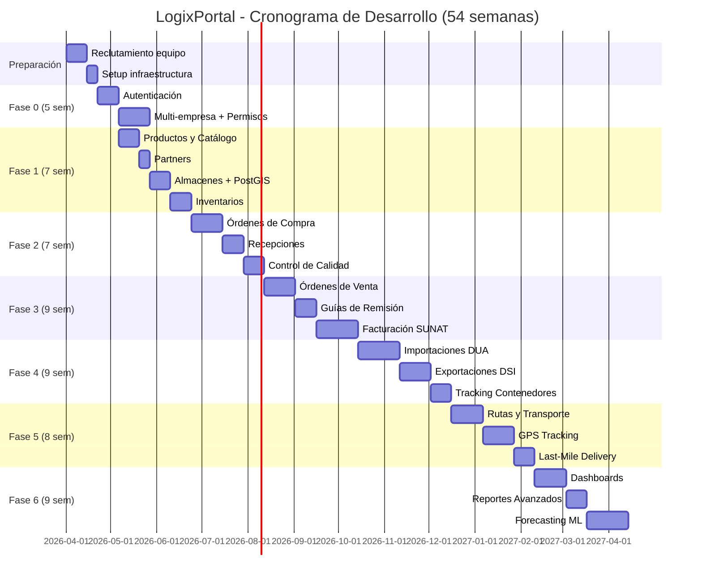

### 10.4 Costos Estimados

```yaml
Costos de Desarrollo (54 semanas):
  Backend Developers (2-3): $180,000 - $270,000
  Frontend Developers (2-3): $180,000 - $270,000
  UI/UX Designer: $90,000
  QA Engineers (1-2): $90,000 - $180,000
  DevOps Engineer: $90,000
  Product Owner: $120,000
  Scrum Master: $100,000
  Total Salarios: $850,000 - $1,180,000

Infraestructura (anual):
  Servidores (AWS/GCP): $24,000/año
  PostgreSQL RDS: $12,000/año
  Redis: $3,600/año
  Certificados SSL: $500/año
  Dominio + Email: $500/año
  Monitoring (Datadog): $6,000/año
  Total Infraestructura: $46,600/año

Licencias y Servicios:
  Serverpod Cloud (opcional): $0 (self-hosted)
  OSE Sunat (homologación): $5,000 una vez
  Certificado Digital: $150/año por empresa
  APIs externas (SUNAT, RENIEC): $0 (públicas)
  Integraciones bancarias: Variable

Costos Únicos:
  Equipos de desarrollo: $30,000
  Diseño de marca/logo: $5,000
  Marketing/Lanzamiento: $20,000
  Total Único: $55,000

TOTAL PROYECTO (54 semanas):
  Mínimo: $905,000 + $46,600 + $60,000 = $1,011,600
  Máximo: $1,235,000 + $46,600 + $60,000 = $1,341,600
```

### 10.5 Riesgos y Mitigación

| Riesgo | Probabilidad | Impacto | Mitigación |
|--------|--------------|---------|------------|
| Complejidad de integración SUNAT | Alta | Alto | Contratar asesor SUNAT externo, POC temprano |
| Cambios en regulaciones | Media | Alto | Arquitectura flexible, capa de abstracción para reglas |
| Rotación de equipo | Media | Alto | Documentación exhaustiva, pair programming |
| Performance de PostGIS | Baja | Medio | Índices optimizados, benchmarks tempranos |
| Curva de aprendizaje Serverpod | Media | Medio | Training inicial, documentación interna |
| Scope creep | Alta | Alto | Product Owner fuerte, backlog priorizado |

---

## 11. DOCUMENTOS ENTREGABLES POR FASE

### 11.1 Fase 0: Fundamentos

| # | Documento | Responsable | Formato |
|---|-----------|-------------|---------|
| 0.1 | Documento de Arquitectura Técnica | Tech Lead | Markdown + Diagramas Mermaid |
| 0.2 | Plan de Deployment y CI/CD | DevOps | YAML + Documentación |
| 0.3 | Guía de Instalación Local | Backend Dev | README.md |
| 0.4 | Manual de Configuración de Serverpod | Backend Dev | Markdown |
| 0.5 | Matriz de Roles y Permisos | Product Owner | Excel |
| 0.6 | Diseño de Tema UI (Material 3) | UI/UX Designer | Figma + Flutter Theme |
| 0.7 | Guía de Estilo de Código | Tech Lead | Markdown |
| 0.8 | Plan de Testing Fase 0 | QA Lead | Test Cases + Results |

### 11.2 Fase 1: Módulo Core

| # | Documento | Responsable | Formato |
|---|-----------|-------------|---------|
| 1.1 | Modelo de Datos Core (DER) | Backend Dev | Mermaid + SQL |
| 1.2 | API Spec - Productos | Backend Dev | OpenAPI/Swagger |
| 1.3 | API Spec - Partners | Backend Dev | OpenAPI/Swagger |
| 1.4 | API Spec - Almacenes e Inventarios | Backend Dev | OpenAPI/Swagger |
| 1.5 | Manual de Usuario - Maestros | Technical Writer | PDF |
| 1.6 | Wireframes de Pantallas Core | UI/UX Designer | Figma |
| 1.7 | Reporte de Testing E2E Fase 1 | QA Lead | Test Report |
| 1.8 | Plan de Migración de Datos | Data Engineer | Markdown + Scripts |

### 11.3 Fase 2: Compras

| # | Documento | Responsable | Formato |
|---|-----------|-------------|---------|
| 2.1 | Modelo de Datos - Procurement | Backend Dev | Mermaid + SQL |
| 2.2 | API Spec - Purchase Orders | Backend Dev | OpenAPI |
| 2.3 | API Spec - Goods Receipts | Backend Dev | OpenAPI |
| 2.4 | Flujo de Aprobación de POs | Product Owner | Diagrama Mermaid |
| 2.5 | Manual de Usuario - Compras | Technical Writer | PDF |
| 2.6 | Template PDF - Orden de Compra | UI/UX Designer | PDF Template |
| 2.7 | Reporte de Performance Testing | QA Lead | Test Report |

### 11.4 Fase 3: Ventas y Facturación

| # | Documento | Responsable | Formato |
|---|-----------|-------------|---------|
| 3.1 | Modelo de Datos - Ventas e Invoicing | Backend Dev | Mermaid + SQL |
| 3.2 | API Spec - Sales Orders | Backend Dev | OpenAPI |
| 3.3 | API Spec - Electronic Documents | Backend Dev | OpenAPI |
| 3.4 | Guía de Integración SUNAT | Backend Dev | Markdown |
| 3.5 | Especificación XML UBL 2.1 | Backend Dev | XML Schema + Ejemplos |
| 3.6 | Manual de Facturación Electrónica | Technical Writer | PDF |
| 3.7 | Template PDF - Factura con QR | UI/UX Designer | PDF Template |
| 3.8 | Certificación OSE (si aplica) | Product Owner | Documento oficial |

### 11.5 Fase 4: Comercio Exterior

| # | Documento | Responsable | Formato |
|---|-----------|-------------|---------|
| 4.1 | Modelo de Datos - Customs | Backend Dev | Mermaid + SQL |
| 4.2 | API Spec - Import/Export Operations | Backend Dev | OpenAPI |
| 4.3 | Guía de Integración VUCE | Backend Dev | Markdown |
| 4.4 | Catálogo de Partidas Arancelarias | Data Engineer | CSV/Database |
| 4.5 | Manual de Despachos Aduaneros | Technical Writer | PDF |
| 4.6 | Calculadora de Costos de Importación | Frontend Dev | Feature Doc |
| 4.7 | Reporte de Integración con APIs Navieras | Backend Dev | Test Report |

### 11.6 Fase 5: Logística

| # | Documento | Responsable | Formato |
|---|-----------|-------------|---------|
| 5.1 | Modelo de Datos - Logistics | Backend Dev | Mermaid + SQL |
| 5.2 | API Spec - Routes & Shipments | Backend Dev | OpenAPI |
| 5.3 | Guía de Configuración PostGIS | DevOps | Markdown |
| 5.4 | Algoritmo de Optimización de Rutas | Backend Dev | Markdown + Código |
| 5.5 | Manual de Gestión de Transporte | Technical Writer | PDF |
| 5.6 | App Móvil - Guía del Chofer | Frontend Mobile Dev | User Guide |

### 11.7 Fase 6: Analytics

| # | Documento | Responsable | Formato |
|---|-----------|-------------|---------|
| 6.1 | Modelo de Datos - Analytics | Backend Dev | Mermaid + SQL |
| 6.2 | Catálogo de KPIs | Product Owner | Excel |
| 6.3 | Especificación de Dashboards | UI/UX Designer | Figma + Spec |
| 6.4 | Documentación Técnica - ML Forecasting | Data Scientist | Jupyter Notebook |
| 6.5 | Manual de Reportería Avanzada | Technical Writer | PDF |
| 6.6 | Guía de Exportación de Datos | Backend Dev | Markdown |

### 11.8 Documentos Continuos

| Documento | Frecuencia | Responsable |
|-----------|------------|-------------|
| Release Notes | Cada release | Product Owner |
| Sprint Retrospective | Cada sprint (2 sem) | Scrum Master |
| Performance Report | Mensual | DevOps |
| Security Audit Report | Trimestral | Security Officer |
| User Feedback Summary | Mensual | Product Owner |
| Backlog Refinement Doc | Semanal | Product Owner |

---

## 12. DIAGRAMAS MERMAID DE ARQUITECTURA

### 12.1 Diagrama de Contexto del Sistema

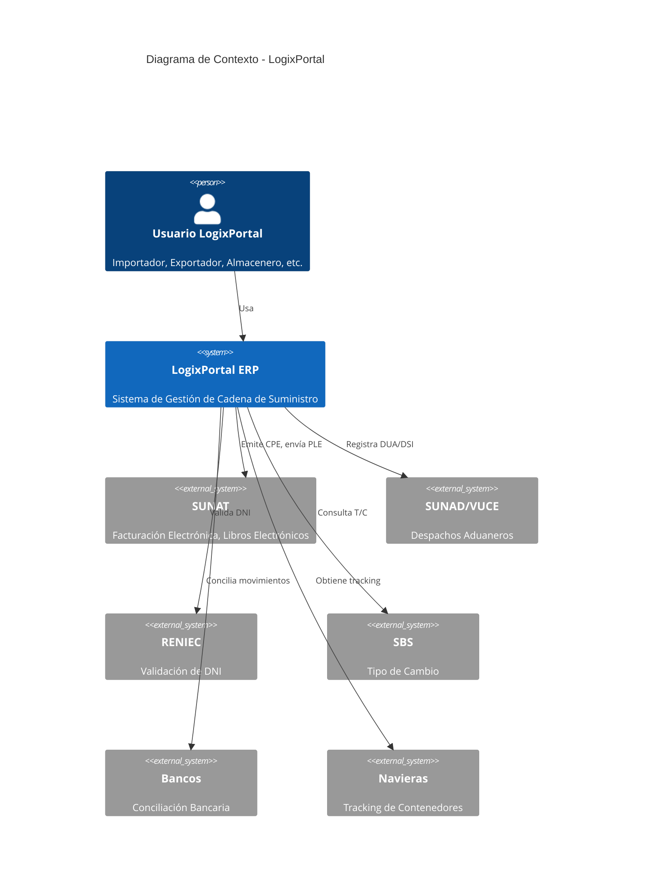

### 12.2 Diagrama de Contenedores

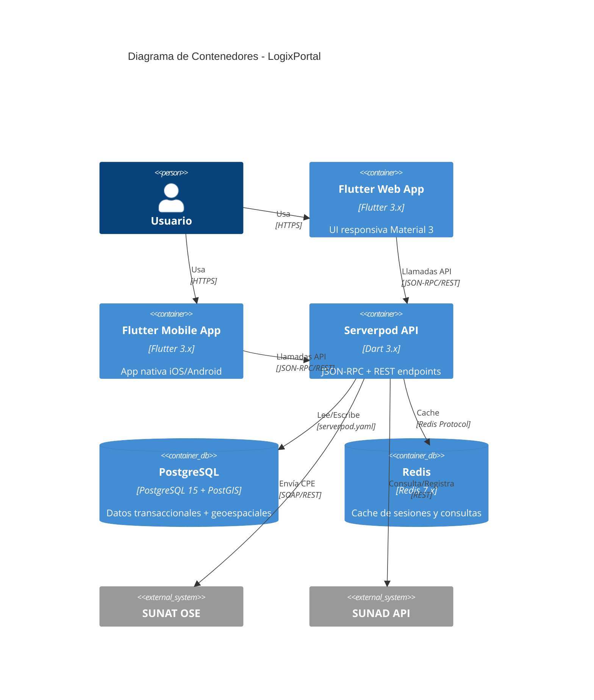

### 12.3 Flujo de Facturación Electrónica

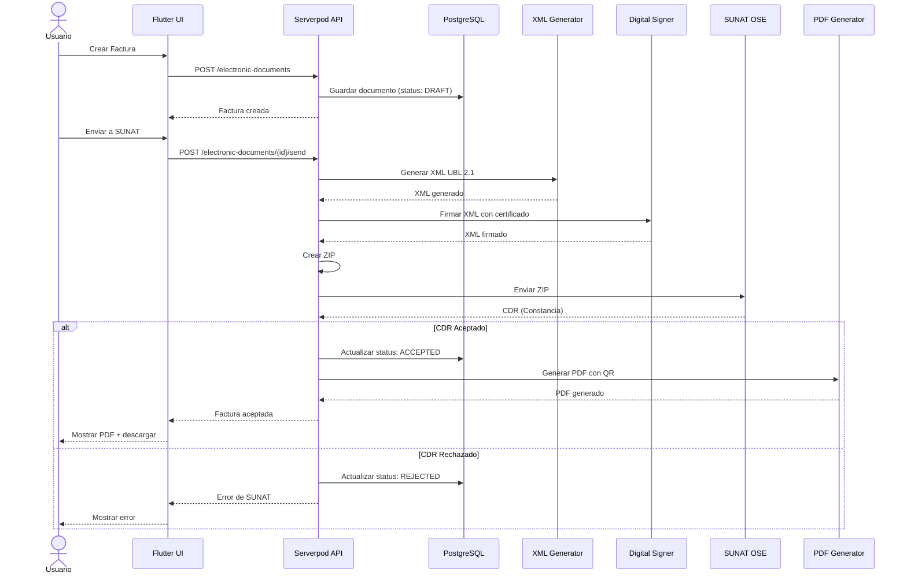

### 12.4 Flujo de Importación con DUA

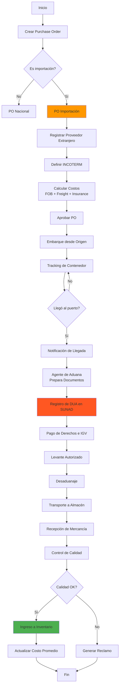

### 12.5 Diagrama de Datos Simplificado (Core)

```mermaid
erDiagram
    COMPANY {
        uuid id PK
        string company_code UK
        string business_name
        string tax_id UK
        string subscription_tier
        jsonb active_modules
        boolean is_active
    }
    
    USER {
        uuid id PK
        uuid company_id FK
        string email UK
        string password_hash
        uuid role_id FK
        boolean is_active
    }
    
    ROLE {
        uuid id PK
        uuid company_id FK
        string name
        jsonb permissions
    }
    
    PRODUCT {
        uuid id PK
        uuid company_id FK
        string product_code
        string name
        string hs_code
        decimal standard_cost
        decimal average_cost
        boolean is_active
    }
    
    WAREHOUSE {
        uuid id PK
        uuid company_id FK
        string warehouse_code
        string name
        point location
    }
    
    INVENTORY_BALANCE {
        uuid id PK
        uuid company_id FK
        uuid product_id FK
        uuid warehouse_id FK
        decimal quantity
        decimal reserved_quantity
        decimal unit_cost
    }
    
    PURCHASE_ORDER {
        uuid id PK
        uuid company_id FK
        string po_number
        uuid supplier_id FK
        string incoterm
        decimal total_amount
        string status
    }
    
    SALES_ORDER {
        uuid id PK
        uuid company_id FK
        string so_number
        uuid customer_id FK
        decimal total_amount
        string status
    }
    
    ELECTRONIC_DOCUMENT {
        uuid id PK
        uuid company_id FK
        string document_type
        string serie
        int number
        uuid customer_id FK
        decimal total_amount
        string status
        text xml_content
        text cdr_content
    }
    
    COMPANY ||--o{ USER : has
    COMPANY ||--o{ PRODUCT : manages
    COMPANY ||--o{ WAREHOUSE : owns
    COMPANY ||--o{ PURCHASE_ORDER : creates
    COMPANY ||--o{ SALES_ORDER : creates
    COMPANY ||--o{ ELECTRONIC_DOCUMENT : issues
    
    USER }o--|| ROLE : assigned
    
    PRODUCT ||--o{ INVENTORY_BALANCE : stored_in
    WAREHOUSE ||--o{ INVENTORY_BALANCE : contains
    
    PURCHASE_ORDER }o--|| BUSINESS_PARTNER : from
    SALES_ORDER }o--|| BUSINESS_PARTNER : to
    ELECTRONIC_DOCUMENT }o--|| BUSINESS_PARTNER : billed_to
    ELECTRONIC_DOCUMENT }o--|| SALES_ORDER : generated_from
```

### 12.6 Arquitectura de Suscripciones

```mermaid
flowchart TD
    U[Usuario] -->|Solicita Feature| MW[Middleware de Validación]
    MW --> SC{Verificar Suscripción}
    
    SC --> DB[(PostgreSQL)]
    DB --> CM[company.subscription_tier]
    DB --> AM[company.active_modules]
    
    CM --> TC{Tier Checker}
    TC -->|BASIC| BF[Features BASIC]
    TC -->|PROFESSIONAL| PF[Features PRO]
    TC -->|ENTERPRISE| EF[Features ENTERPRISE]
    
    AM --> AC{Addon Checker}
    AC --> AAF[Features de Add-ons Activos]
    
    BF --> MG[Merge Features]
    PF --> MG
    EF --> MG
    AAF --> MG
    
    MG --> RQ{Feature Requerido<br/>en merged list?}
    
    RQ -->|Sí| ALLOW[✅ Permitir Acceso]
    RQ -->|No| DENY[❌ Denegar Acceso]
    
    ALLOW --> EP[Endpoint Logic]
    DENY --> ER[Error Response:<br/>403 Forbidden<br/>"Feature not available<br/>in your subscription"]
    
    style ALLOW fill:#4CAF50
    style DENY fill:#F44336
    style MW fill:#2196F3
```

---

## 13. CONCLUSIÓN Y PRÓXIMOS PASOS

### 13.1 Resumen

Este documento maestro define la arquitectura completa de **LogixPortal**, un ERP especializado en cadena de suministro global con cumplimiento normativo peruano. El proyecto se estructura en:

- ✅ **Stack moderno**: Serverpod 3 + Flutter 3 + PostgreSQL + PostGIS
- ✅ **Arquitectura escalable**: Clean Architecture Feature-First
- ✅ **Multi-empresa**: Sin multi-tenancy, aislamiento por company_id
- ✅ **Cumplimiento legal**: Integración nativa SUNAT, SUNAD, RENIEC
- ✅ **Suscripción flexible**: Módulos activables por empresa
- ✅ **Entrega incremental**: 6 fases, 54 semanas, MVP funcional desde Fase 1

### 13.2 Próximos Pasos Inmediatos

1. **Semana 1-2: Validación con Stakeholders**
   - Revisar este prompt con el equipo ejecutivo
   - Aprobar presupuesto y timeline
   - Confirmar priorización de fases

2. **Semana 3-4: Reclutamiento**
   - Contratar Backend Developers (Dart/Serverpod)
   - Contratar Frontend Developers (Flutter)
   - Contratar UI/UX Designer

3. **Semana 5: Setup Inicial**
   - Configurar infraestructura (servidores, PostgreSQL, Redis)
   - Setup repositorio Git + CI/CD
   - Crear proyecto Serverpod base

4. **Semana 6+: Inicio Fase 0**
   - Sprint Planning Fase 0
   - Desarrollo de autenticación
   - Implementación multi-empresa

### 13.3 Criterios de Éxito Global

- ✅ **95%+ de facturas electrónicas** aceptadas por SUNAT en primer envío
- ✅ **<3 días** para cierre contable mensual
- ✅ **99.5%+ precisión** de inventario
- ✅ **<2 segundos** de tiempo de respuesta promedio
- ✅ **500+ usuarios concurrentes** soportados
- ✅ **100% de trazabilidad** para auditoría BASC/OEA
- ✅ **Zero critical bugs** en producción por 30 días

---

## ANEXOS

### A. Glosario de Términos

| Término | Definición |
|---------|------------|
| **BASC** | Business Alliance for Secure Commerce - Certificación de seguridad en cadena de suministro |
| **CDR** | Constancia de Recepción - Documento de SUNAT confirmando aceptación de comprobante electrónico |
| **CPE** | Comprobante de Pago Electrónico - Factura, boleta, NC, ND electrónica |
| **DUA** | Declaración Única de Aduanas - Documento de importación |
| **DSI** | Declaración Simplificada de Importación - Documento simplificado de importación |
| **HS Code** | Harmonized System Code - Código arancelario internacional |
| **IGV** | Impuesto General a las Ventas - 18% en Perú |
| **INCOTERM** | International Commercial Terms - Términos de comercio internacional (EXW, FOB, CIF, etc.) |
| **OEA** | Operador Económico Autorizado - Certificación aduanera de confianza |
| **OSE** | Operador de Servicios Electrónicos - Intermediario para envío de CPE a SUNAT |
| **PLE** | Programa de Libros Electrónicos - Sistema de libros contables electrónicos SUNAT |
| **RLS** | Row-Level Security - Seguridad a nivel de fila en PostgreSQL |
| **RUC** | Registro Único de Contribuyentes - Identificador tributario peruano |
| **SUNAD** | Superintendencia Nacional de Aduanas |
| **SUNAT** | Superintendencia Nacional de Aduanas y Tributación |
| **UBL** | Universal Business Language - Estándar XML para documentos comerciales |
| **VUCE** | Ventanilla Única de Comercio Exterior |

### B. Referencias Técnicas

- **Serverpod Documentation**: https://docs.serverpod.dev/
- **Flutter Clean Architecture**: https://resocoder.com/flutter-clean-architecture/
- **Riverpod Documentation**: https://riverpod.dev/
- **PostGIS Documentation**: https://postgis.net/docs/
- **SUNAT - Facturación Electrónica**: https://cpe.sunat.gob.pe/
- **UBL 2.1 Specification**: http://docs.oasis-open.org/ubl/UBL-2.1.html

### C. Contactos Clave

| Rol | Responsabilidad | Email (ejemplo) |
|-----|-----------------|---------|
| Product Owner | Priorización y requisitos | po@logixportal.com |
| Tech Lead | Arquitectura y decisiones técnicas | techlead@logixportal.com |
| DevOps Lead | Infraestructura y deployment | devops@logixportal.com |
| QA Lead | Estrategia de testing | qa@logixportal.com |

---

**Fin del Documento Maestro**

Este prompt debe ser usado como guía de referencia para todas las fases de desarrollo de LogixPortal. Se recomienda revisar y actualizar trimestralmente según el feedback del equipo y usuarios.